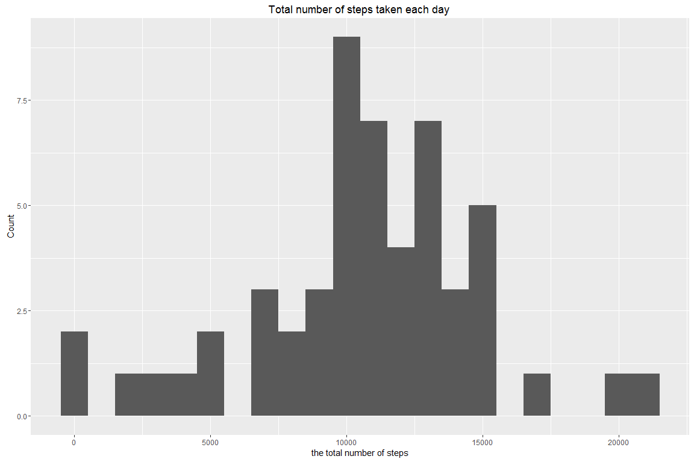
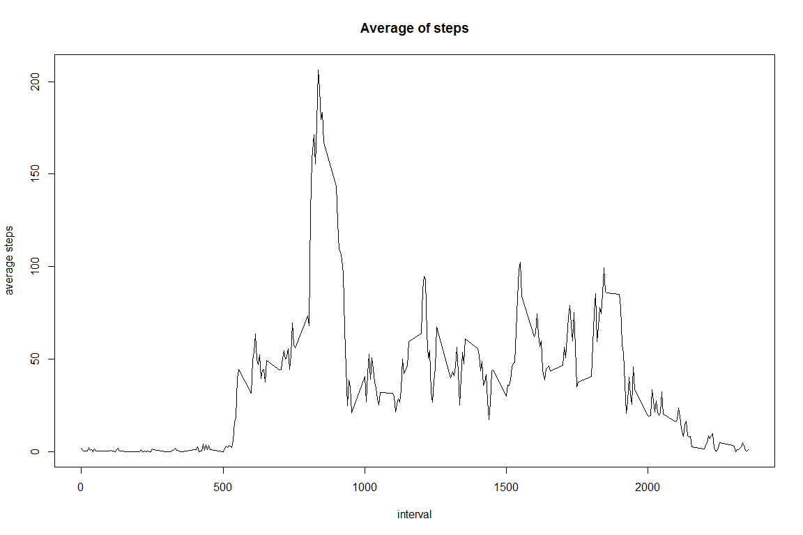
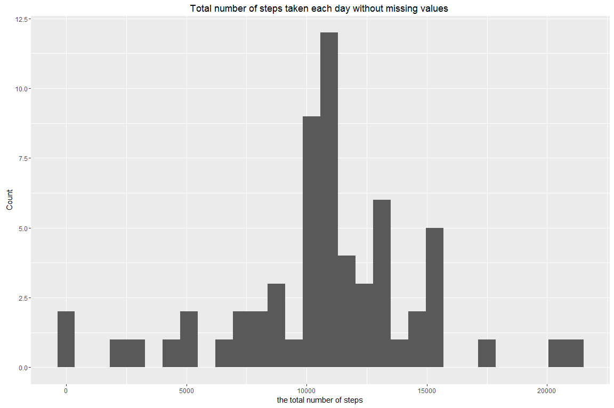
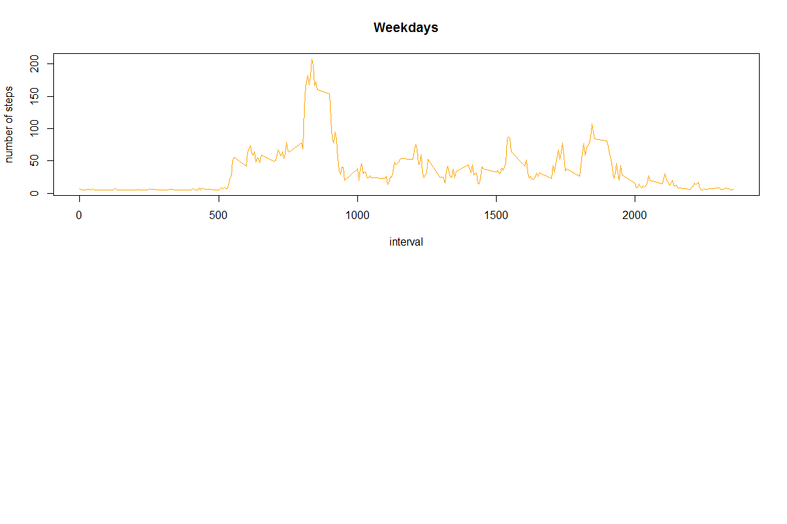
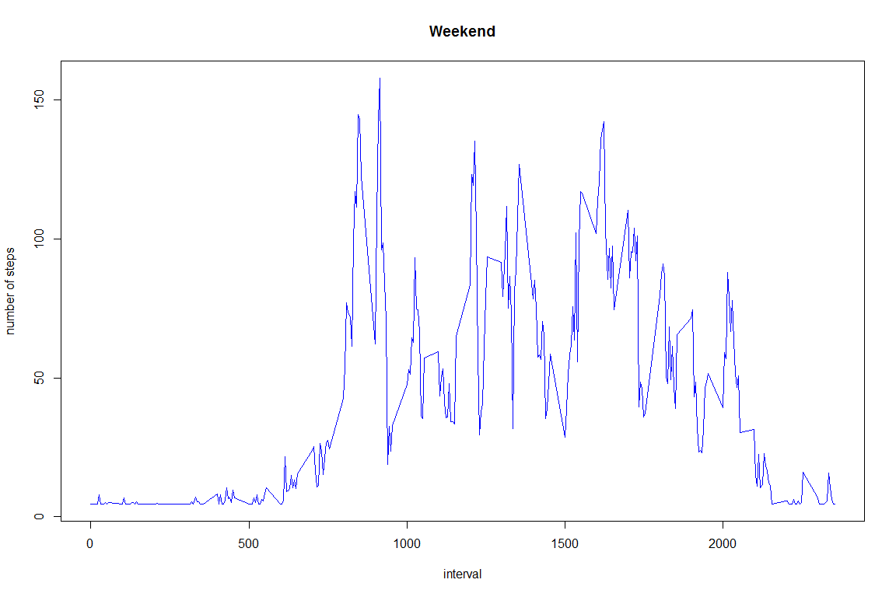

Loading and preprocessing the data
----------------------------------

### 1.Show any code that is needed to

Load the data (i.e. read.csv())

    activity <- read.csv("activity.csv")

### 2.Process/transform the data (if necessary) into a format suitable for your analysis:

There is not necessary

What is mean total number of steps taken per day?
-------------------------------------------------

For this part of the assignment, you can ignore the missing values in
the dataset.

### 1.Calculate the total number of steps taken per day

    activityTotalDay <- aggregate(steps ~ date,activity, sum)
    activityTotalDay

    ##          date steps
    ## 1  2012-10-02   126
    ## 2  2012-10-03 11352
    ## 3  2012-10-04 12116
    ## 4  2012-10-05 13294
    ## 5  2012-10-06 15420
    ## 6  2012-10-07 11015
    ## 7  2012-10-09 12811
    ## 8  2012-10-10  9900
    ## 9  2012-10-11 10304
    ## 10 2012-10-12 17382
    ## 11 2012-10-13 12426
    ## 12 2012-10-14 15098
    ## 13 2012-10-15 10139
    ## 14 2012-10-16 15084
    ## 15 2012-10-17 13452
    ## 16 2012-10-18 10056
    ## 17 2012-10-19 11829
    ## 18 2012-10-20 10395
    ## 19 2012-10-21  8821
    ## 20 2012-10-22 13460
    ## 21 2012-10-23  8918
    ## 22 2012-10-24  8355
    ## 23 2012-10-25  2492
    ## 24 2012-10-26  6778
    ## 25 2012-10-27 10119
    ## 26 2012-10-28 11458
    ## 27 2012-10-29  5018
    ## 28 2012-10-30  9819
    ## 29 2012-10-31 15414
    ## 30 2012-11-02 10600
    ## 31 2012-11-03 10571
    ## 32 2012-11-05 10439
    ## 33 2012-11-06  8334
    ## 34 2012-11-07 12883
    ## 35 2012-11-08  3219
    ## 36 2012-11-11 12608
    ## 37 2012-11-12 10765
    ## 38 2012-11-13  7336
    ## 39 2012-11-15    41
    ## 40 2012-11-16  5441
    ## 41 2012-11-17 14339
    ## 42 2012-11-18 15110
    ## 43 2012-11-19  8841
    ## 44 2012-11-20  4472
    ## 45 2012-11-21 12787
    ## 46 2012-11-22 20427
    ## 47 2012-11-23 21194
    ## 48 2012-11-24 14478
    ## 49 2012-11-25 11834
    ## 50 2012-11-26 11162
    ## 51 2012-11-27 13646
    ## 52 2012-11-28 10183
    ## 53 2012-11-29  7047

### 2.If you do not understand the difference between a histogram and a barplot, research the difference between them. Make a histogram of the total number of steps taken each day

    library(ggplot2)
    qplot(activityTotalDay$steps,binwidth = 1000,  xlab="the total number of steps",ylab="Count",main="Total number of steps taken each day ")

<!-- -->

### 3.Calculate and report the mean and median of the total number of steps taken per day

mean:

    activityMeanDay <- mean(activityTotalDay$steps)
    activityMeanDay

    ## [1] 10766.19

median:

    activityMedianDay <- median(activityTotalDay$steps)
    activityMedianDay

    ## [1] 10765

What is the average daily activity pattern?
-------------------------------------------

### 1.Make a time series plot (i.e. type = "l") of the 5-minute interval (x-axis) and the average number of steps taken, averaged across all days (y-axis)

    activity5average <- aggregate(steps ~ interval,activity, mean)

    plot(activity5average$interval,activity5average$steps, type="l", col="black", xlab="interval", ylab="average steps", main="Average of steps")

<!-- -->

### 2.Which 5-minute interval, on average across all the days in the dataset, contains the maximum number of steps?

The maximun number is:

     max <- activity5average[activity5average$steps==max(activity5average$steps),1]
     max

    ## [1] 835

Imputing missing values
-----------------------

Note that there are a number of days/intervals where there are missing
values (coded as NA). The presence of missing days may introduce bias
into some calculations or summaries of the data.

### 1.Calculate and report the total number of missing values in the dataset (i.e. the total number of rows with NAs)

    summary(activity)

    ##      steps                date          interval     
    ##  Min.   :  0.00   2012-10-01:  288   Min.   :   0.0  
    ##  1st Qu.:  0.00   2012-10-02:  288   1st Qu.: 588.8  
    ##  Median :  0.00   2012-10-03:  288   Median :1177.5  
    ##  Mean   : 37.38   2012-10-04:  288   Mean   :1177.5  
    ##  3rd Qu.: 12.00   2012-10-05:  288   3rd Qu.:1766.2  
    ##  Max.   :806.00   2012-10-06:  288   Max.   :2355.0  
    ##  NA's   :2304     (Other)   :15840

### 2.Devise a strategy for filling in all of the missing values in the dataset. The strategy does not need to be sophisticated. For example, you could use the mean/median for that day, or the mean for that 5-minute interval, etc.

    activity[is.na(activity[,1]), 1] <- mean(activity[,1], na.rm = TRUE)

### 3.Create a new dataset that is equal to the original dataset but with the missing data filled in.

    activity_na <- activity
    activity <- read.csv("activity.csv")

### 4.Make a histogram of the total number of steps taken each day and Calculate and report the mean and median total number of steps taken per day. Do these values differ from the estimates from the first part of the assignment? What is the impact of imputing missing data on the estimates of the total daily number of steps?

total:

    activity_naTotal <- aggregate(steps ~ date,activity_na, sum)
    activity_naTotal

    ##          date    steps
    ## 1  2012-10-01 10766.19
    ## 2  2012-10-02   126.00
    ## 3  2012-10-03 11352.00
    ## 4  2012-10-04 12116.00
    ## 5  2012-10-05 13294.00
    ## 6  2012-10-06 15420.00
    ## 7  2012-10-07 11015.00
    ## 8  2012-10-08 10766.19
    ## 9  2012-10-09 12811.00
    ## 10 2012-10-10  9900.00
    ## 11 2012-10-11 10304.00
    ## 12 2012-10-12 17382.00
    ## 13 2012-10-13 12426.00
    ## 14 2012-10-14 15098.00
    ## 15 2012-10-15 10139.00
    ## 16 2012-10-16 15084.00
    ## 17 2012-10-17 13452.00
    ## 18 2012-10-18 10056.00
    ## 19 2012-10-19 11829.00
    ## 20 2012-10-20 10395.00
    ## 21 2012-10-21  8821.00
    ## 22 2012-10-22 13460.00
    ## 23 2012-10-23  8918.00
    ## 24 2012-10-24  8355.00
    ## 25 2012-10-25  2492.00
    ## 26 2012-10-26  6778.00
    ## 27 2012-10-27 10119.00
    ## 28 2012-10-28 11458.00
    ## 29 2012-10-29  5018.00
    ## 30 2012-10-30  9819.00
    ## 31 2012-10-31 15414.00
    ## 32 2012-11-01 10766.19
    ## 33 2012-11-02 10600.00
    ## 34 2012-11-03 10571.00
    ## 35 2012-11-04 10766.19
    ## 36 2012-11-05 10439.00
    ## 37 2012-11-06  8334.00
    ## 38 2012-11-07 12883.00
    ## 39 2012-11-08  3219.00
    ## 40 2012-11-09 10766.19
    ## 41 2012-11-10 10766.19
    ## 42 2012-11-11 12608.00
    ## 43 2012-11-12 10765.00
    ## 44 2012-11-13  7336.00
    ## 45 2012-11-14 10766.19
    ## 46 2012-11-15    41.00
    ## 47 2012-11-16  5441.00
    ## 48 2012-11-17 14339.00
    ## 49 2012-11-18 15110.00
    ## 50 2012-11-19  8841.00
    ## 51 2012-11-20  4472.00
    ## 52 2012-11-21 12787.00
    ## 53 2012-11-22 20427.00
    ## 54 2012-11-23 21194.00
    ## 55 2012-11-24 14478.00
    ## 56 2012-11-25 11834.00
    ## 57 2012-11-26 11162.00
    ## 58 2012-11-27 13646.00
    ## 59 2012-11-28 10183.00
    ## 60 2012-11-29  7047.00
    ## 61 2012-11-30 10766.19

    qplot(activity_naTotal$steps,data=activity_naTotal,  xlab="the total number of steps",ylab ="Count",main="Total number of steps taken each day without missing values ")

<!-- -->

mean:

    activity_naMeanDay <- mean(activity_naTotal$steps)
    activity_naMeanDay

    ## [1] 10766.19

median:

    activity_naMedianDay <- median(activity_naTotal$steps)
    activity_naMedianDay

    ## [1] 10766.19

There is a impact but it is litle.

Are there differences in activity patterns between weekdays and weekends?
-------------------------------------------------------------------------

For this part the weekdays() function may be of some help here. Use the
dataset with the filled-in missing values for this part.

### 1.Create a new factor variable in the dataset with two levels - "weekday" and "weekend" indicating whether a given date is a weekday or weekend day.

    dateformat <-strptime(activity_na$date,"%Y-%m-%d")
    activitynew <- data.frame(activity_na,dateformat)

    weekdays_S <- c('lunes', 'martes', 'miércoles', 'jueves', 'viernes')

    daynew <- factor((weekdays(activitynew$dateformat) %in% weekdays_S), 
                       levels=c(FALSE, TRUE), labels=c('weekend', 'weekday')) 
    activitynew <- data.frame(activity_na,daynew)

### 2.Make a panel plot containing a time series plot (i.e. type = "l") of the 5-minute interval (x-axis) and the average number of steps taken, averaged across all weekday days or weekend days (y-axis). See the README file in the GitHub repository to see an example of what this plot should look like using simulated data.

    activityWday <- aggregate(steps ~ interval,data=subset(activitynew,daynew=="weekday"), mean)

    activityWend <- aggregate(steps ~ interval,data=subset(activitynew,daynew=="weekend"), mean)

    par(mfrow=c(2,1))

    plot(activityWday$interval, activityWday$steps, type="l", col="orange", xlab="interval", ylab="number of steps",main="Weekdays")

<!-- -->

    plot(activityWend$interval, activityWend$steps, type="l", col="blue", xlab="interval", ylab="number of steps",main="Weekend")

<!-- -->
